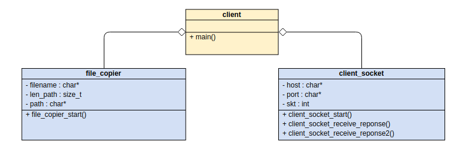
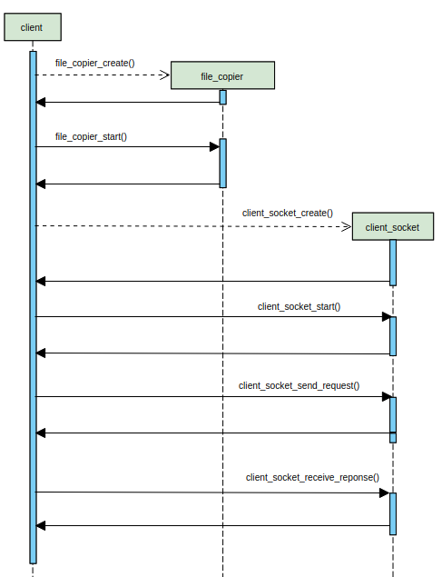
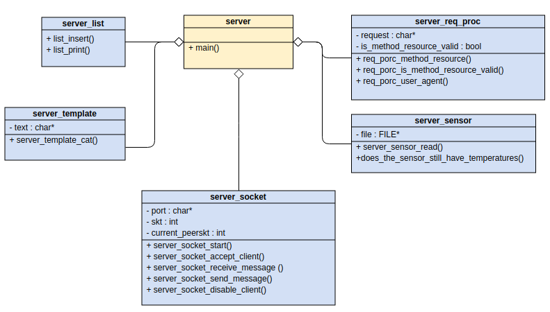
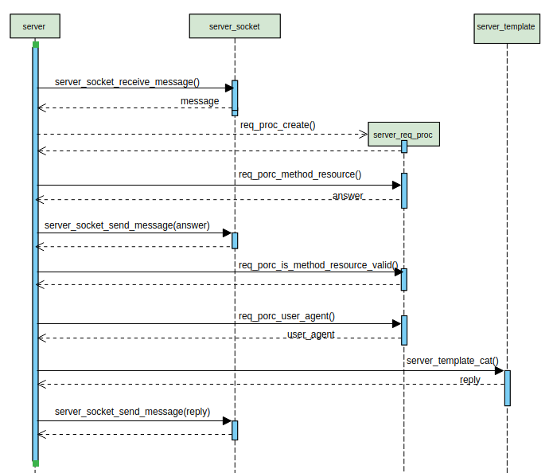

# Informe
## Descripción de las estructuras utilizadas
Las actores principales de este trabajo práctico son el cliente y el servidor. 
 
[//]: < Cada uno de ellos cuenta con una estructura socket (`struct client_socket` y `struct server_socket` respectivamente) que les permite interactuar. >
 
### Client
- El `struct client_socket` es la estructura más importante que contiene el cliente y tiene dos responsabilidades principales:
    1) Crear el socket definiendo la familia, el tipo de socket y el protocolo para poder conectarse al servidor por medio del _port_ y _host_ indicados.
    2) Enviar y recibir mensajes  al servidor.
 
    Es decir, esta estructura se encarga puramente de la interacción con el servidor.
 
- El `strcut file copier` es un tipo abstracto de datos cuya única función es leer un archivo y copiarlo en un buffer.
 
### Server
- El `struct server_socket` es muy similar al `struct client_socket`. Es también una estructura primordial para el server. Tiene tres responsabilidades principales:
    1) Crear el socket con los atributos correspondientes y con un _port_ específico al cual el cliente va a poder conectarse.
    2) Aceptar y deshabilitar clientes.
    3) Enviar y recibir mensajes al cliente.
    En este caso también podemos concluir que esta estructura se encarga puramente de la interacción con el cliente.
 
- El `struct server_list` asimila el comportamiento de una lista enlazada pero cuenta con ciertas particularidades:
    1) Los datos que se guardan en los nodos son de tipo _clave valor_
    2) Al insertar un dato se pasa únicamente la clave. Si no existe una clave igual en la lista se la agrega y se inicializa su valor en 0. Si existe la clave se aumenta en uno su valor.
    Es decir, es una lista enlazada implementada especificamente para contar apariciones de los datos que se van almacenando.
- El `struct server_req_proc` se encarga de procesar un pedido HTTP, advertir si es correcto o incorrecto, indicar la respuesta HTTP correspondiente y el _user agent_.
 
- El `struct server_sensor` se ocupa de leer de un archivo binario una temperatura almacenada en 16 bits y formato big-endian. La misma la interpreta de la siguiente forma: Temperatura = (datos - 2000) / 100. Además, se encarga de comunicar si quedan o no temperaturas por leer.
 
- El `struct server_template` lee un archivo HTML que contendrá en alguna parte el texto "{{datos}}". Su responsabilidad es reemplazar del texto "{{datos}}" por un string pasado por parámetro.
 
## Esquema del diseño
### Cliente
 

 

El diagrama de secuencia muestra cómo el cliente maneja las distintas estructuras para leer el archivo recibido y enviarlo al servidor.
### Server
 

 

El diagrama de secuencia muestra cómo se el servidor maneja las distintas estructuras para procesar el mensaje de un cliente.
